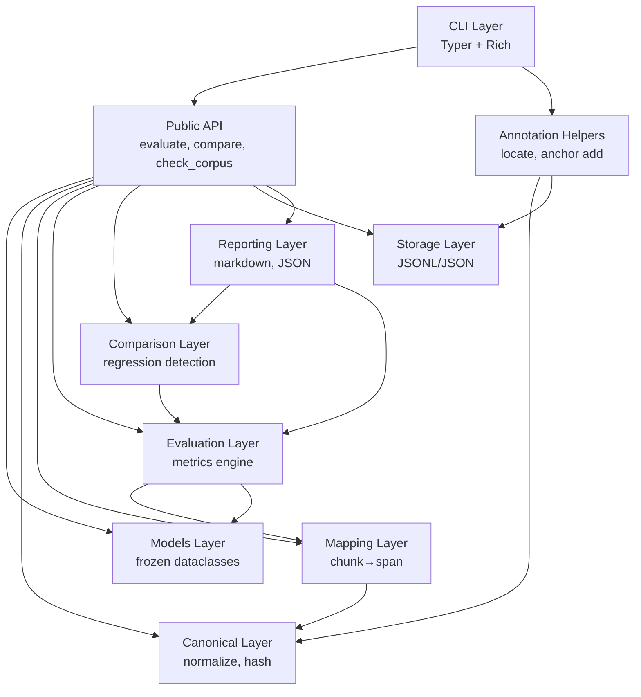

# Design Document: Spanchor

## Overview

Spanchor is a Python library and CLI tool for regression-testing RAG retrieval pipelines using stable source-document anchors. The system enables developers to anchor gold labels to character spans in canonical source documents, then evaluate any retriever output against those anchors.

**Core Architecture Principles:**
- Separation of source evidence from retrieval representation
- Deterministic, local-first operation (no network calls, no telemetry)
- Explicit validation and error reporting at every step
- All offsets are Unicode code-point based on canonical text (NFC normalized, newline normalized)
- Half-open interval semantics [start, end) throughout

**Key Workflows:**
1. **Gold Set Creation**: Developers annotate source documents with anchor spans, creating stable test sets
2. **Evaluation**: Retrieval results (spans or chunk text) are mapped to canonical document spans and scored against gold anchors using character-level metrics
3. **Regression Testing**: Baseline and candidate runs are compared with configurable thresholds; CI fails if per-query regressions exceed policy

**Non-Goals:**
- RAG framework integration (framework-agnostic)
- Vector database or embedding management
- Document parsing/OCR
- LLM provider integration
- Answer quality evaluation (retrieval only)

## Architecture

### High-Level Component Diagram



### Layer Responsibilities

1. **Models Layer** (`models/`)
   - Frozen slotted dataclasses: `Document`, `Anchor`, `Query`, `RetrievalResult`, `Run`
   - Schema versioning on all serialized types
   - Explicit field validators (no Pydantic dependency)

2. **Canonical Layer** (`canonical/`)
   - Unicode NFC normalization
   - Newline normalization (\r\n and \r → \n)
   - SHA256 hashing of canonical text
   - Ensures stable anchor offsets across platforms

3. **Mapping Layer** (`mapping/`)
   - Maps chunk text to canonical document spans
   - Exact substring matching (primary path)
   - Whitespace-normalized matching with offset map (fallback)
   - Ambiguity resolution policies: first-unclaimed, all-occurrences, fail
   - Returns status: MAPPED_EXACT, MAPPED_NORMALIZED, AMBIGUOUS, UNMAPPED

4. **Evaluation Layer** (`evaluation/`)
   - **Interval algebra** (`intervals.py`): union, intersection, length computation using sorted-interval merging (O(n log n))
   - **Metrics** (`recall.py`, `precision.py`, `hit.py`, `iou.py`):
     - Recall@K, Precision@K: character-level coverage
     - Hit@K: boolean success for single-span queries
     - FullEvidence@K: boolean success requiring all gold spans covered
     - IoU: diagnostic metric for overall alignment
   - Macro-average aggregation (default), optional micro-average

5. **Comparison Layer** (`comparison/`)
   - Per-query metric deltas (baseline vs candidate)
   - Status classification: IMPROVED, REGRESSION, UNCHANGED
   - Policy enforcement (max_drop thresholds per metric)
   - Small-sample warnings (< 30 queries)

6. **Storage Layer** (`storage/`)
   - JSONL reader/writer for gold sets (one query per line)
   - JSON reader/writer for runs
   - Schema version validation
   - Typed error reporting: InvalidSchemaError, DocumentNotFoundError

7. **Reporting Layer** (`reporting/`)
   - Markdown tables: aggregate metrics, per-query metrics, comparison deltas
   - JSON output: full structured results
   - Redaction mode: omit source text for privacy/size

8. **Annotation Helpers** (`annotation/`)
   - `locate`: find text in documents, show candidates with context
   - `anchor add`: create validated anchor entries via CLI

9. **CLI Layer** (`cli.py`)
   - Typer-based commands: `validate`, `evaluate`, `compare`, `locate`, `anchor`, `check-corpus`
   - Rich output formatting
   - Exit codes: 0 (pass), 1 (regression), 2 (schema/usage error), 3 (unmapped rate exceeded)

10. **Public API** (`__init__.py`)
    - Exports: `Anchor`, `Document`, `Query`, `evaluate()`, `compare()`, `check_corpus()`
    - Testing helper: `spanchor.testing.assert_no_regression()`

### Data Flow

**Evaluation Flow:**
```
Documents → Canonicalize → Hash
Gold Set (JSONL) → Parse → Validate Anchors
Retrieval Results → Map Chunks → Validated Spans
(Gold Spans, Retrieved Spans) → Interval Algebra → Metrics → Run
```

**Comparison Flow:**
```
Baseline Run + Candidate Run → Delta Computation → Status Classification → Policy Check → Exit Code
```

## Components and Interfaces

### 1. Models (`models/`)

#### Document
```python
@dataclass(frozen=True, slots=True)
class Document:
    document_id: str
    text: str              # canonical form
    sha256: str
    schema_version: str = "0.1.0"
    
    @staticmethod
    def from_text(document_id: str, raw_text: str) -> Document:
        """Create document with canonicalization and hashing."""
        canonical = normalize_text(raw_text)
        hash_val = compute_hash(canonical)
        return Document(document_id, canonical, hash_val)
```

#### Anchor
```python
@dataclass(frozen=True, slots=True)
class Anchor:
    document_id: str
    start: int             # inclusive, code-point offset
    end: int               # exclusive, code-point offset
    expected_text_hash: str
    schema_version: str = "0.1.0"
    
    def validate(self, doc: Document) -> None:
        """Raise typed error if invalid."""
        if doc.sha256 != self.expected_text_hash:
            raise HashMismatchError(...)
        if not (0 <= self.start < self.end <= len(doc.text)):
            raise AnchorResolutionError(...)
        actual_text = doc.text[self.start:self.end]
        # Additional validation logic
```

#### Query
```python
@dataclass(frozen=True, slots=True)
class Query:
    query_id: str
    question: str
    anchors: tuple[Anchor, ...]  # frozen, hashable
    schema_version: str = "0.1.0"
```

#### RetrievalResult
```python
@dataclass(frozen=True, slots=True)
class RetrievalResult:
    # Span form
    document_id: str | None
    start: int | None
    end: int | None
    
    # Chunk-text form
    text: str | None
    
    # Common
    rank: int
    score: float
    span_type: str = "text"
    metadata: dict[str, Any] = field(default_factory=dict)
    schema_version: str = "0.1.0"
    
    def needs_mapping(self) -> bool:
        """True if chunk-text form."""
        return self.text is not None and self.document_id is None
```

#### Run
```python
@dataclass(frozen=True, slots=True)
class Run:
    timestamp: str
    queries: tuple[Query, ...]
    per_query_metrics: dict[str, dict[str, float]]  # query_id -> metric -> value
    aggregate_metrics: dict[str, float]
    config: dict[str, Any]
    mapper_stats: dict[str, int]  # MAPPED_EXACT, UNMAPPED, etc.
    schema_version: str = "0.1.0"
```

### 2. Canonical Layer (`canonical/`)

#### normalize.py
```python
def normalize_text(raw: str) -> str:
    """NFC + newline normalization."""
    # Apply NFC Unicode normalization
    # Replace \r\n → \n
    # Replace \r → \n
    return normalized

def compute_hash(text: str) -> str:
    """SHA256 of canonical text."""
    return hashlib.sha256(text.encode('utf-8')).hexdigest()
```

### 3. Mapping Layer (`mapping/`)

#### Chunk Mapper
```python
@dataclass
class MappingResult:
    status: Literal["MAPPED_EXACT", "MAPPED_NORMALIZED", "AMBIGUOUS", "UNMAPPED"]
    spans: list[tuple[str, int, int]]  # (document_id, start, end)
    method: str  # "exact_substring", "whitespace_normalized"

class ChunkMapper:
    def __init__(
        self,
        documents: dict[str, Document],
        ambiguity_policy: Literal["first_unclaimed", "all_occurrences", "fail"] = "first_unclaimed"
    ):
        self.documents = documents
        self.policy = ambiguity_policy
        self.claimed_spans: set[tuple[str, int, int]] = set()
    
    def map_chunk(self, chunk_text: str, document_id: str | None) -> MappingResult:
        """Map chunk text to canonical spans."""
        # 1. Exact substring search (in doc or across corpus)
        # 2. If no match, try whitespace-normalized with offset map
        # 3. Handle ambiguity per policy
        # 4. Return MappingResult with status and spans
```

**Ambiguity Resolution:**
- **first_unclaimed**: Map to first occurrence not already claimed by another chunk in this query
- **all_occurrences**: Create multiple spans (one per occurrence)
- **fail**: Raise AnchorResolutionError

### 4. Evaluation Layer (`evaluation/`)

#### intervals.py
```python
Interval = tuple[int, int]  # [start, end) half-open

def union(intervals: list[Interval]) -> list[Interval]:
    """Merge overlapping intervals. O(n log n)."""
    if not intervals:
        return []
    sorted_intervals = sorted(intervals)
    merged = [sorted_intervals[0]]
    for current in sorted_intervals[1:]:
        last = merged[-1]
        if current[0] <= last[1]:  # overlapping or adjacent
            merged[-1] = (last[0], max(last[1], current[1]))
        else:
            merged.append(current)
    return merged

def intersection(a: list[Interval], b: list[Interval]) -> list[Interval]:
    """Compute intersection of two interval sets."""
    # Merge a and b, then find overlaps
    result = []
    i, j = 0, 0
    while i < len(a) and j < len(b):
        start = max(a[i][0], b[j][0])
        end = min(a[i][1], b[j][1])
        if start < end:
            result.append((start, end))
        if a[i][1] < b[j][1]:
            i += 1
        else:
            j += 1
    return result

def length(intervals: list[Interval]) -> int:
    """Total character count in merged intervals."""
    return sum(end - start for start, end in union(intervals))
```

#### recall.py, precision.py
```python
def recall_at_k(
    gold_spans: list[Interval],
    retrieved_spans: list[Interval],
    k: int
) -> float:
    """Character-level recall: |G ∩ R| / |G|."""
    if k <= 0:
        raise EvaluationError("K must be positive")
    
    G = union(gold_spans)
    R = union(retrieved_spans[:k])
    
    g_len = length(G)
    if g_len == 0:
        raise EvaluationError("Gold spans cannot be empty")
    
    overlap = length(intersection(G, R))
    return overlap / g_len

def precision_at_k(
    gold_spans: list[Interval],
    retrieved_spans: list[Interval],
    k: int
) -> float:
    """Character-level precision: |G ∩ R| / |R|."""
    G = union(gold_spans)
    R = union(retrieved_spans[:k])
    
    r_len = length(R)
    if r_len == 0:
        return 0.0
    
    overlap = length(intersection(G, R))
    return overlap / r_len
```

#### hit.py
```python
def hit_at_k(
    gold_spans: list[Interval],
    retrieved_spans: list[Interval],
    k: int,
    min_overlap: float = 0.5
) -> int:
    """1 if ANY gold span has >= min_overlap covered, else 0."""
    R = union(retrieved_spans[:k])
    
    for g_start, g_end in gold_spans:
        g_len = g_end - g_start
        overlap = length(intersection([(g_start, g_end)], R))
        if overlap / g_len >= min_overlap:
            return 1
    return 0

def full_evidence_at_k(
    gold_spans: list[Interval],
    retrieved_spans: list[Interval],
    k: int,
    min_overlap: float = 0.5
) -> int:
    """1 if ALL gold spans have >= min_overlap covered, else 0."""
    R = union(retrieved_spans[:k])
    
    for g_start, g_end in gold_spans:
        g_len = g_end - g_start
        overlap = length(intersection([(g_start, g_end)], R))
        if overlap / g_len < min_overlap:
            return 0
    return 1
```

#### iou.py
```python
def iou(gold_spans: list[Interval], retrieved_spans: list[Interval]) -> float:
    """Intersection-over-Union: |G ∩ R| / |G ∪ R|. Diagnostic only."""
    G = union(gold_spans)
    R = union(retrieved_spans)
    
    G_union_R = union(G + R)
    union_len = length(G_union_R)
    
    if union_len == 0:
        return 0.0
    
    overlap = length(intersection(G, R))
    return overlap / union_len
```

### 5. Comparison Layer (`comparison/`)

#### compare.py
```python
@dataclass
class ComparisonResult:
    per_query_deltas: dict[str, dict[str, float]]  # query_id -> metric -> delta
    per_query_status: dict[str, Literal["IMPROVED", "REGRESSION", "UNCHANGED"]]
    aggregate_deltas: dict[str, float]
    has_regression: bool

def compare(
    baseline: Run,
    candidate: Run,
    policy: dict[str, float]  # metric -> max_drop
) -> ComparisonResult:
    """Compare two runs and classify per-query changes."""
    # Compute per-query deltas
    # Classify: if delta < -max_drop → REGRESSION
    #           if delta > max_drop → IMPROVED
    #           else → UNCHANGED
    # Aggregate across queries
    return ComparisonResult(...)
```

### 6. Storage Layer (`storage/`)

#### jsonl.py
```python
def read_gold_set(path: Path) -> list[Query]:
    """Read JSONL gold set with validation."""
    queries = []
    seen_ids = set()
    
    with path.open() as f:
        for line_num, line in enumerate(f, start=1):
            try:
                data = json.loads(line)
                validate_schema(data, "Query")
                query = Query(**data)
                
                if query.query_id in seen_ids:
                    raise InvalidSchemaError(
                        f"Duplicate query_id '{query.query_id}' at line {line_num}"
                    )
                seen_ids.add(query.query_id)
                queries.append(query)
            except (json.JSONDecodeError, TypeError, ValueError) as e:
                raise InvalidSchemaError(
                    f"Line {line_num}: {e}. Check JSON formatting."
                )
    
    return queries

def write_run(path: Path, run: Run, redact: bool = False) -> None:
    """Write Run to JSON."""
    data = asdict(run)
    if redact:
        # Strip source text from queries and results
        pass
    with path.open('w') as f:
        json.dump(data, f, indent=2)
```

### 7. Reporting Layer (`reporting/`)

#### markdown.py
```python
def generate_evaluation_report(run: Run, redact: bool = False) -> str:
    """Generate markdown evaluation report."""
    sections = []
    
    # Aggregate metrics table
    sections.append("## Aggregate Metrics\n")
    sections.append("| Metric | Value |\n|--------|-------|")
    for metric, value in run.aggregate_metrics.items():
        sections.append(f"| {metric} | {value:.4f} |")
    
    # Mapper statistics
    sections.append("\n## Mapping Statistics\n")
    sections.append("| Status | Count |\n|--------|-------|")
    for status, count in run.mapper_stats.items():
        sections.append(f"| {status} | {count} |")
    
    # Per-query metrics
    sections.append("\n## Per-Query Metrics\n")
    # Table with query_id | Recall@5 | Precision@5 | Hit@5 | ...
    
    return "\n".join(sections)

def generate_comparison_report(
    comparison: ComparisonResult,
    baseline: Run,
    candidate: Run,
    redact: bool = False
) -> str:
    """Generate markdown comparison report."""
    sections = []
    
    # Summary
    sections.append("## Comparison Summary\n")
    improved = sum(1 for s in comparison.per_query_status.values() if s == "IMPROVED")
    regressed = sum(1 for s in comparison.per_query_status.values() if s == "REGRESSION")
    unchanged = sum(1 for s in comparison.per_query_status.values() if s == "UNCHANGED")
    sections.append(f"- Improved: {improved}")
    sections.append(f"- Regressed: {regressed}")
    sections.append(f"- Unchanged: {unchanged}")
    
    # Per-query delta table
    sections.append("\n## Per-Query Deltas\n")
    # Table with query_id | Status | Recall@5 Δ | Precision@5 Δ | ...
    
    return "\n".join(sections)
```

### 8. CLI Layer (`cli.py`)

```python
import typer
from rich.console import Console

app = typer.Typer()
console = Console()

@app.command()
def validate(
    docs_dir: Path = typer.Argument(..., help="Directory with source documents"),
    gold_path: Path = typer.Argument(..., help="Path to gold.jsonl"),
):
    """Validate gold set against documents."""
    try:
        documents = load_documents(docs_dir)
        queries = read_gold_set(gold_path)
        
        for query in queries:
            for anchor in query.anchors:
                doc = documents.get(anchor.document_id)
                if not doc:
                    raise DocumentNotFoundError(anchor.document_id, query.query_id)
                anchor.validate(doc)
        
        console.print(f"[green]✓ Validated {len(documents)} documents, "
                     f"{len(queries)} queries, "
                     f"{sum(len(q.anchors) for q in queries)} anchors[/green]")
        raise typer.Exit(0)
    except SpanchorError as e:
        console.print(f"[red]{e}[/red]")
        raise typer.Exit(2)

@app.command()
def evaluate(
    docs_dir: Path,
    gold_path: Path,
    results_path: Path,
    output: Path | None = typer.Option(None, help="Save run to JSON"),
    report: Path | None = typer.Option(None, help="Save markdown report"),
    redact: bool = typer.Option(False, help="Omit source text from output"),
    k: int = typer.Option(5, help="K for metrics (Recall@K, etc.)"),
    max_unmapped_rate: float = typer.Option(0.1, help="Max unmapped chunk rate"),
):
    """Evaluate retrieval results against gold set."""
    # Load documents, gold, results
    # Map chunks to spans
    # Compute metrics
    # Check unmapped rate
    # Write output/report if specified
    # Exit 0 or 3

@app.command()
def compare(
    baseline_path: Path,
    candidate_path: Path,
    report: Path | None = typer.Option(None),
    policy_path: Path | None = typer.Option(None),
    max_recall_drop: float | None = typer.Option(None),
    max_precision_drop: float | None = typer.Option(None),
    redact: bool = typer.Option(False),
):
    """Compare two runs and detect regressions."""
    # Load runs
    # Load or build policy
    # Run comparison
    # Generate report
    # Exit 0 (no regression) or 1 (regression)

@app.command()
def locate(
    text: str,
    docs_dir: Path,
):
    """Find text in documents and show anchor candidates."""
    # Search for exact matches
    # If none, try whitespace-normalized
    # Display with context

@app.command()
def anchor(
    # Subcommands: add, remove, list
):
    """Manage anchors in gold set."""
    pass

@app.command()
def check_corpus(
    docs_dir: Path,
    gold_path: Path,
):
    """Verify document corpus health."""
    # Validate all anchor hashes, offsets, text matches
    # Report issues
    # Exit 0 (healthy) or 2 (issues)
```

### 9. Public API (`__init__.py`)

```python
from spanchor.models import Anchor, Document, Query, RetrievalResult, Run
from spanchor.evaluation import evaluate
from spanchor.comparison import compare
from spanchor.validation import check_corpus
from spanchor.errors import (
    SpanchorError,
    InvalidSchemaError,
    DocumentNotFoundError,
    HashMismatchError,
    AnchorResolutionError,
    OrphanedAnchorError,
    InvalidRetrievalResultError,
    EvaluationError,
    ComparisonError,
)

__all__ = [
    "Anchor",
    "Document",
    "Query",
    "RetrievalResult",
    "Run",
    "evaluate",
    "compare",
    "check_corpus",
    # Errors
    "SpanchorError",
    "InvalidSchemaError",
    "DocumentNotFoundError",
    "HashMismatchError",
    "AnchorResolutionError",
    "OrphanedAnchorError",
    "InvalidRetrievalResultError",
    "EvaluationError",
    "ComparisonError",
]
```

### 10. Testing Helper (`spanchor/testing.py`)

```python
def assert_no_regression(
    baseline: Run,
    candidate: Run,
    policy: dict[str, float],
) -> None:
    """Assert no regressions. Raise AssertionError if any found."""
    result = compare(baseline, candidate, policy)
    
    if result.has_regression:
        regressed_queries = [
            qid for qid, status in result.per_query_status.items()
            if status == "REGRESSION"
        ]
        
        details = []
        for qid in regressed_queries:
            deltas = result.per_query_deltas[qid]
            for metric, delta in deltas.items():
                if delta < -policy.get(metric, 0):
                    details.append(
                        f"  {qid}: {metric} dropped {delta:.4f} "
                        f"(threshold: -{policy[metric]:.4f})"
                    )
        
        raise AssertionError(
            f"Regression detected in {len(regressed_queries)} queries:\n" +
            "\n".join(details)
        )
```

## Data Models

### Serialization Format

All serialized data includes `schema_version` field for forward compatibility.

**Gold Set (JSONL):**
```json
{"schema_version": "0.1.0", "query_id": "q1", "question": "What is the capital?", "anchors": [{"document_id": "doc1", "start": 100, "end": 150, "expected_text_hash": "abc123..."}]}
{"schema_version": "0.1.0", "query_id": "q2", "question": "...", "anchors": [...]}
```

**Retrieval Results (JSON):**
```json
{
  "schema_version": "0.1.0",
  "query_id": "q1",
  "results": [
    {"rank": 1, "score": 0.95, "document_id": "doc1", "start": 100, "end": 150},
    {"rank": 2, "score": 0.82, "text": "chunk text here"}
  ]
}
```

**Run (JSON):**
```json
{
  "schema_version": "0.1.0",
  "timestamp": "2024-01-15T10:30:00Z",
  "config": {"k": 5, "min_overlap": 0.5},
  "aggregate_metrics": {
    "recall@5": 0.85,
    "precision@5": 0.72,
    "hit@5": 0.90
  },
  "per_query_metrics": {
    "q1": {"recall@5": 0.88, "precision@5": 0.75}
  },
  "mapper_stats": {
    "MAPPED_EXACT": 45,
    "MAPPED_NORMALIZED": 5,
    "AMBIGUOUS": 2,
    "UNMAPPED": 1
  }
}
```

### Offset Semantics

- **Encoding**: All offsets are Unicode code-point offsets (not byte offsets)
- **Interval Type**: Half-open intervals [start, end) where start is inclusive, end is exclusive
- **Canonical Text**: Offsets apply to canonical form (NFC normalized, newline normalized)

**Example:**
```python
text = "Hello, world!"
span = (0, 5)  # "Hello" → text[0:5] in Python slice notation
```

### Hash Integrity

Every `Anchor` stores `expected_text_hash` (SHA256 of document). On validation:
1. Compute current document hash
2. Compare with expected hash
3. If mismatch → `HashMismatchError` with both hashes and suggestion to re-canonicalize or update anchors

## Correctness Properties

*A property is a characteristic or behavior that should hold true across all valid executions of a system—essentially, a formal statement about what the system should do. Properties serve as the bridge between human-readable specifications and machine-verifiable correctness guarantees.*

### Property Reflection

After analyzing all acceptance criteria, I identified the following areas suitable for property-based testing:

**Core Data Properties:**
- Document canonicalization (normalization idempotence, hash stability)
- Anchor validation (bounds checking, text matching)
- Serialization round-trips

**Interval Algebra Properties:**
- Union and intersection correctness and mathematical properties (idempotence, symmetry)
- Length computation accuracy

**Metric Properties:**
- Recall/Precision bounds and monotonicity
- Hit/FullEvidence threshold behavior
- IoU symmetry

**Mapping Properties:**
- Chunk-to-span mapping accuracy
- Ambiguity detection
- Policy enforcement

**Potential Redundancies Eliminated:**
- Multiple bounds-checking properties consolidated into single comprehensive property
- Separate normalization properties combined into canonicalization round-trip property
- Individual metric bound checks combined where they share the same underlying constraint

### Properties

### Property 1: Document Canonicalization Idempotence

*For any* text string with arbitrary Unicode normalization form and newline sequences, applying canonicalization once and applying it twice SHALL produce identical results with identical SHA256 hashes.

**Validates: Requirements 1.1, 1.2, 1.3, 1.5**

### Property 2: Document Serialization Round-Trip

*For any* valid Document, serializing to JSON and deserializing SHALL preserve the document_id, canonical text, and sha256 hash exactly.

**Validates: Requirements 1.5**

### Property 3: Anchor Offset Slice Semantics

*For any* valid Anchor with offsets [start, end) and corresponding Document, extracting text using document.text[start:end] SHALL produce the expected anchor text.

**Validates: Requirements 2.2**

### Property 4: Anchor Validation Detects Invalid Offsets

*For any* Anchor with offsets outside document bounds [0, len(document.text)), validation SHALL raise AnchorResolutionError.

**Validates: Requirements 2.5**

### Property 5: Anchor Validation Detects Hash Mismatches

*For any* Anchor and Document where anchor.expected_text_hash != document.sha256, validation SHALL raise HashMismatchError with both hash values.

**Validates: Requirements 2.4**

### Property 6: Query Set Duplicate Detection

*For any* collection of Query objects with duplicate query_id values, loading as a Gold_Set SHALL raise InvalidSchemaError identifying the duplicated ID.

**Validates: Requirements 3.5, 3.7**

### Property 7: Query Serialization Round-Trip

*For any* valid Query with 0, 1, or multiple Anchors, serializing to JSONL and deserializing SHALL produce an equivalent Query with identical query_id, question, and anchor content.

**Validates: Requirements 3.2, 3.4**

### Property 8: Retrieval Result Classification

*For any* RetrievalResult in chunk-text form (text is not None and document_id is None), the needs_mapping() method SHALL return True.

**Validates: Requirements 4.5**

### Property 9: Retrieval Result Rank Validation

*For any* RetrievalResult with rank <= 0, validation SHALL fail indicating ranks must be positive integers.

**Validates: Requirements 4.6**

### Property 10: Chunk Mapper Exact Substring Detection

*For any* chunk text that is an exact substring of a document, the Chunk_Mapper SHALL find the chunk and return MAPPED_EXACT status.

**Validates: Requirements 5.1, 5.2**

### Property 11: Chunk Mapper Whitespace Normalization Fallback

*For any* chunk text that differs from document text only by whitespace, the Chunk_Mapper SHALL successfully map it with MAPPED_NORMALIZED status.

**Validates: Requirements 5.3**

### Property 12: Chunk Mapper Ambiguity Detection

*For any* chunk text appearing N > 1 times in the search space, the Chunk_Mapper SHALL mark the result as AMBIGUOUS.

**Validates: Requirements 5.4**

### Property 13: Chunk Mapper Unmapped Detection

*For any* chunk text not present in the document corpus (even after whitespace normalization), the Chunk_Mapper SHALL return UNMAPPED status.

**Validates: Requirements 5.9**

### Property 14: Chunk Mapper Policy Enforcement - First Unclaimed

*For any* AMBIGUOUS chunk with policy="first_unclaimed", mapping SHALL return the first occurrence not yet claimed by another chunk in the same query.

**Validates: Requirements 5.5**

### Property 15: Chunk Mapper Policy Enforcement - All Occurrences

*For any* AMBIGUOUS chunk with policy="all_occurrences" appearing N times, mapping SHALL create N span results.

**Validates: Requirements 5.6**

### Property 16: Interval Union Idempotence

*For any* set of intervals X, union(union(X)) SHALL equal union(X).

**Validates: Requirements 6.6**

### Property 17: Interval Intersection Symmetry

*For any* interval sets X and Y, intersection(X, Y) SHALL equal intersection(Y, X).

**Validates: Requirements 6.7**

### Property 18: Interval Union Merges Overlaps

*For any* set of intervals containing overlapping or adjacent spans, union SHALL merge them into a minimal non-overlapping set.

**Validates: Requirements 6.1, 6.4**

### Property 19: Interval Length Computation

*For any* set of intervals X, length(union(X)) SHALL equal the sum of character counts in the merged intervals.

**Validates: Requirements 6.3**

### Property 20: Recall Metric Bounds

*For any* valid gold and retrieved span sets with non-empty gold spans and K > 0, Recall@K SHALL be in the range [0, 1] inclusive.

**Validates: Requirements 7.1, 7.6**

### Property 21: Precision Metric Bounds

*For any* valid gold and retrieved span sets with K > 0, Precision@K SHALL be in the range [0, 1] inclusive.

**Validates: Requirements 7.2, 7.7**

### Property 22: Recall Monotonicity

*For any* gold and retrieved span sets and K values where K < len(retrieved_spans), Recall@(K+1) SHALL be greater than or equal to Recall@K.

**Validates: Requirements 7.8**

### Property 23: Hit Metric Threshold Behavior

*For any* query where at least one gold span has coverage >= min_overlap, Hit@K SHALL return 1; otherwise 0.

**Validates: Requirements 8.1, 8.2**

### Property 24: FullEvidence Metric Requires All Spans

*For any* query where all gold spans have coverage >= min_overlap, FullEvidence@K SHALL return 1; if any span has coverage < min_overlap, SHALL return 0.

**Validates: Requirements 8.3, 8.4**

### Property 25: Min Overlap Parameter Validation

*For any* min_overlap value outside the range [0, 1], metric computation SHALL raise an error.

**Validates: Requirements 8.7**

### Property 26: IoU Metric Bounds

*For any* valid gold and retrieved span sets, IoU SHALL be in the range [0, 1] inclusive.

**Validates: Requirements 9.1, 9.2**

### Property 27: IoU Symmetry

*For any* span sets X and Y, IoU(X, Y) SHALL equal IoU(Y, X).

**Validates: Requirements 9.4**

### Property 28: Macro-Average Computation

*For any* set of per-query metric values, the macro-average SHALL equal the arithmetic mean across all queries.

**Validates: Requirements 10.1**

### Property 29: Micro-Average Pools Characters First

*For any* set of queries, micro-average SHALL be computed by pooling all gold and retrieved characters across queries before computing the metric, not by averaging per-query metrics.

**Validates: Requirements 10.2**

### Property 30: Retrieved Character Count Accuracy

*For any* query with retrieved spans, the reported character count SHALL equal the total character count in union(retrieved_spans).

**Validates: Requirements 10.3**

### Property 31: Comparison Delta Computation

*For any* two Runs (baseline and candidate) with matching query sets, per-query deltas SHALL equal candidate_metric - baseline_metric for each metric.

**Validates: Requirements 12.1**

### Property 32: Status Classification by Threshold

*For any* query metric delta, if delta < -max_drop then status SHALL be REGRESSION; if delta > max_drop then IMPROVED; otherwise UNCHANGED.

**Validates: Requirements 12.2, 12.3, 12.4, 12.5**

### Property 33: JSONL Serialization Round-Trip

*For any* valid Gold_Set, serializing to JSONL and deserializing SHALL produce an equivalent Gold_Set with all queries, query_ids, questions, and anchors preserved.

**Validates: Requirements 14.1, 14.2**

### Property 34: Run JSON Serialization Round-Trip

*For any* valid Run, serializing to JSON and deserializing SHALL preserve all metrics, config, and metadata exactly.

**Validates: Requirements 14.2**


## Error Handling

### Error Type Hierarchy

```python
class SpanchorError(Exception):
    """Base exception for all spanchor errors."""
    pass

class InvalidSchemaError(SpanchorError):
    """Schema validation or format violation."""
    def __init__(self, message: str, file_path: str | None = None, line_num: int | None = None):
        detail = f"{file_path}:{line_num}: " if file_path and line_num else ""
        super().__init__(f"{detail}{message}")

class DocumentNotFoundError(SpanchorError):
    """Referenced document does not exist."""
    def __init__(self, document_id: str, query_id: str | None = None):
        context = f" in query '{query_id}'" if query_id else ""
        super().__init__(
            f"Document '{document_id}' not found{context}. "
            f"Ensure all referenced documents are in the corpus directory."
        )

class HashMismatchError(SpanchorError):
    """Document hash does not match expected hash."""
    def __init__(self, document_id: str, expected: str, actual: str):
        super().__init__(
            f"Hash mismatch for document '{document_id}'. "
            f"Expected: {expected[:16]}..., Actual: {actual[:16]}... "
            f"Suggestion: Document may have been modified. "
            f"Re-validate anchors or re-canonicalize the document."
        )

class AnchorResolutionError(SpanchorError):
    """Anchor cannot be resolved to valid span."""
    def __init__(
        self,
        document_id: str,
        start: int | None = None,
        end: int | None = None,
        reason: str = "Invalid offsets or text mismatch"
    ):
        super().__init__(
            f"Cannot resolve anchor in document '{document_id}' [{start}:{end}]. "
            f"{reason}. "
            f"Suggestion: Verify offsets are within document bounds and text matches expected content."
        )

class OrphanedAnchorError(SpanchorError):
    """Anchor references a document that was deleted."""
    def __init__(self, document_id: str, query_id: str):
        super().__init__(
            f"Anchor in query '{query_id}' references deleted document '{document_id}'. "
            f"Suggestion: Remove the anchor or restore the document to the corpus."
        )

class InvalidRetrievalResultError(SpanchorError):
    """Retrieval result is malformed."""
    def __init__(self, reason: str):
        super().__init__(
            f"Invalid retrieval result: {reason}. "
            f"Suggestion: Ensure rank is positive, score is numeric, and either "
            f"(document_id, start, end) or (text) is provided."
        )

class EvaluationError(SpanchorError):
    """Error during metric computation."""
    def __init__(self, reason: str):
        super().__init__(
            f"Evaluation failed: {reason}. "
            f"Suggestion: Check that gold spans are non-empty and K is positive."
        )

class ComparisonError(SpanchorError):
    """Error during run comparison."""
    def __init__(self, reason: str):
        super().__init__(
            f"Comparison failed: {reason}. "
            f"Suggestion: Ensure runs have matching query sets and valid policy thresholds."
        )
```

### Error Message Principles

1. **What Happened**: Describe the error condition clearly
2. **Context**: Include relevant IDs, values, file paths, line numbers
3. **Actionable Suggestion**: Tell the user how to fix it

**Example:**
```
InvalidSchemaError: gold.jsonl:42: Duplicate query_id 'q17'. 
Suggestion: Each query must have a unique query_id. Remove or rename the duplicate.
```

### Exit Codes

- **0**: Success (validation passed, evaluation completed, no regressions)
- **1**: Regression detected (comparison found per-query regressions exceeding policy thresholds)
- **2**: Usage or schema error (invalid arguments, malformed data, missing files)
- **3**: Unmapped rate threshold exceeded (too many chunks could not be mapped to corpus)

## Testing Strategy

### Testing Approach

Spanchor uses a **dual testing strategy** combining property-based testing (PBT) with example-based unit tests:

- **Property-based tests**: Verify universal correctness properties across randomly generated inputs
- **Example-based unit tests**: Verify specific scenarios, edge cases, and error messages
- **Integration tests**: Verify end-to-end workflows and CLI commands
- **Regression tests**: Ensure bug fixes remain fixed

### Property-Based Testing Configuration

**Library**: Hypothesis (Python PBT library)

**Test Configuration**:
- Minimum 100 iterations per property test (configurable via `@given` decorator)
- Each property test tagged with design property reference
- Tag format: `# Feature: spanchor, Property {N}: {property_text}`

**Example:**
```python
from hypothesis import given, strategies as st

@given(
    intervals=st.lists(st.tuples(st.integers(min_value=0, max_value=1000), 
                                   st.integers(min_value=0, max_value=1000)))
)
@pytest.mark.property_test
def test_interval_union_idempotence(intervals):
    """
    Feature: spanchor, Property 16: Interval Union Idempotence
    For any set of intervals X, union(union(X)) shall equal union(X).
    """
    # Validate intervals to ensure start < end
    valid_intervals = [(min(a, b), max(a, b)) for a, b in intervals if a != b]
    
    first_union = union(valid_intervals)
    second_union = union(first_union)
    
    assert first_union == second_union
```

### Test Coverage by Component

#### 1. Canonical Layer (Property Tests + Unit Tests)
**Property Tests:**
- Property 1: Canonicalization idempotence (100+ random Unicode strings)
- Property 2: Document serialization round-trip (100+ random documents)

**Unit Tests:**
- NFC normalization specific examples (é, combining characters)
- Newline normalization: \r\n, \r, \n edge cases
- Hash computation matches expected SHA256
- Empty string handling

#### 2. Models Layer (Property Tests + Unit Tests)
**Property Tests:**
- Property 3: Anchor offset slice semantics (100+ random anchors)
- Property 4: Anchor validation bounds checking (100+ invalid offsets)
- Property 5: Hash mismatch detection (100+ mismatched pairs)
- Property 6: Duplicate query_id detection (100+ query sets)
- Property 7: Query serialization round-trip (100+ queries with varying anchor counts)
- Property 8: RetrievalResult classification (100+ results)
- Property 9: Rank validation (100+ invalid ranks)

**Unit Tests:**
- Specific error messages for each error type
- Schema version handling
- Default parameter values (span_type="text", min_overlap=0.5)
- Frozen dataclass immutability

#### 3. Mapping Layer (Property Tests + Unit Tests)
**Property Tests:**
- Property 10: Exact substring detection (100+ chunk/document pairs)
- Property 11: Whitespace normalization fallback (100+ whitespace variations)
- Property 12: Ambiguity detection (100+ duplicate chunks)
- Property 13: Unmapped detection (100+ non-existent chunks)
- Property 14: First-unclaimed policy (100+ ambiguous scenarios)
- Property 15: All-occurrences policy (100+ ambiguous scenarios)

**Unit Tests:**
- Policy="fail" raises error on ambiguity
- Multi-document chunk spanning
- Mapper statistics accuracy
- Offset map construction and lookup

#### 4. Evaluation Layer (Property Tests + Unit Tests)
**Property Tests:**
- Property 16: Union idempotence (100+ interval sets)
- Property 17: Intersection symmetry (100+ interval pairs)
- Property 18: Union merges overlaps (100+ overlapping sets)
- Property 19: Length computation (100+ interval sets)
- Property 20: Recall bounds (100+ span pairs)
- Property 21: Precision bounds (100+ span pairs)
- Property 22: Recall monotonicity (100+ span sets with varying K)
- Property 23: Hit threshold behavior (100+ coverage scenarios)
- Property 24: FullEvidence all-spans requirement (100+ multi-span queries)
- Property 25: Min overlap validation (100+ invalid values)
- Property 26: IoU bounds (100+ span pairs)
- Property 27: IoU symmetry (100+ span pairs)
- Property 28: Macro-average computation (100+ metric sets)
- Property 29: Micro-average pooling (100+ query sets)
- Property 30: Character count accuracy (100+ retrieval results)

**Unit Tests:**
- Empty gold spans raise EvaluationError
- K=0 raises EvaluationError
- Precision with |R|=0 returns 0.0
- IoU with empty union returns 0.0
- Specific interval examples (adjacent, nested, disjoint)

#### 5. Comparison Layer (Property Tests + Unit Tests)
**Property Tests:**
- Property 31: Delta computation (100+ run pairs)
- Property 32: Status classification (100+ delta/threshold combinations)

**Unit Tests:**
- Small-sample warning (< 30 queries)
- Minimum-query-count guard
- Aggregate delta computation
- has_regression flag correctness

#### 6. Storage Layer (Property Tests + Unit Tests)
**Property Tests:**
- Property 33: JSONL serialization round-trip (100+ gold sets)
- Property 34: Run JSON serialization round-trip (100+ runs)

**Unit Tests:**
- InvalidSchemaError with line numbers
- Unsupported schema_version handling
- Malformed JSON handling
- Redaction mode strips text correctly

#### 7. Reporting Layer (Unit Tests + Integration Tests)
**Unit Tests:**
- Markdown table formatting
- JSON structure validity
- Redaction removes source text
- Aggregate vs per-query sections

**Integration Tests:**
- Full evaluation report generation
- Full comparison report generation
- Report file I/O

#### 8. CLI Layer (Integration Tests)
**Integration Tests:**
- `validate` command: success path, error paths
- `evaluate` command: full evaluation with output/report
- `compare` command: baseline vs candidate with policy
- `locate` command: exact and normalized search
- `anchor add` command: unique and ambiguous cases
- `check-corpus` command: hash/offset validation
- Exit codes: 0 (pass), 1 (regression), 2 (error), 3 (unmapped threshold)

#### 9. Annotation Helpers (Integration Tests)
**Integration Tests:**
- Text location with context display
- Anchor creation with validation
- Ambiguity handling (occurrence selection)
- Gold file append vs create

#### 10. Public API (Unit Tests)
**Unit Tests:**
- All exports available from `spanchor` module
- `assert_no_regression` function behavior
- Error types importable
- Protocol definition

### Test Organization

```
tests/
  unit/
    test_canonical.py
    test_models.py
    test_mapping.py
    test_intervals.py
    test_metrics.py
    test_comparison.py
    test_storage.py
    test_reporting.py
    test_errors.py
  integration/
    test_evaluate_workflow.py
    test_compare_workflow.py
    test_cli_commands.py
    test_annotation_helpers.py
  regression/
    test_fixed_bugs.py
  fixtures/
    sample_docs/
    sample_gold.jsonl
    sample_results.json
```

### Coverage Target

- **Overall**: >= 90% line coverage on `src/spanchor/`
- **Core modules** (canonical, models, evaluation): >= 95%
- **CLI and reporting**: >= 85%

### Hypothesis Strategies

Custom strategies for generating valid test data:

```python
# strategies.py
from hypothesis import strategies as st

@st.composite
def valid_unicode_text(draw):
    """Generate arbitrary Unicode text."""
    return draw(st.text(min_size=0, max_size=1000))

@st.composite
def valid_intervals(draw, max_value=1000):
    """Generate valid [start, end) intervals."""
    start = draw(st.integers(min_value=0, max_value=max_value))
    end = draw(st.integers(min_value=start, max_value=max_value))
    return (start, end)

@st.composite
def valid_document(draw):
    """Generate valid Document."""
    doc_id = draw(st.text(min_size=1, max_size=50))
    text = draw(valid_unicode_text())
    return Document.from_text(doc_id, text)

@st.composite
def valid_anchor(draw, document):
    """Generate valid Anchor for a Document."""
    max_offset = len(document.text)
    start = draw(st.integers(min_value=0, max_value=max(0, max_offset - 1)))
    end = draw(st.integers(min_value=start + 1, max_value=max_offset))
    return Anchor(
        document_id=document.document_id,
        start=start,
        end=end,
        expected_text_hash=document.sha256
    )

@st.composite
def valid_query(draw, documents):
    """Generate valid Query with random anchors."""
    query_id = draw(st.text(min_size=1, max_size=50))
    question = draw(st.text(min_size=1, max_size=200))
    num_anchors = draw(st.integers(min_value=0, max_value=5))
    anchors = []
    for _ in range(num_anchors):
        doc = draw(st.sampled_from(documents))
        anchor = draw(valid_anchor(doc))
        anchors.append(anchor)
    return Query(query_id=query_id, question=question, anchors=tuple(anchors))
```

### Continuous Integration

**.github/workflows/tests.yml:**
- Run tests on Python 3.11, 3.12, 3.13
- Run property tests with seed randomization
- Fail build if coverage < 90%
- Run mypy --strict
- Run ruff linting

**.github/workflows/release.yml:**
- Run full test suite
- Build package with hatchling
- Publish to PyPI on tagged releases

### Manual Testing Scenarios

While automated tests cover correctness properties, manual testing verifies:

1. **CLI UX**: Rich output formatting, error message clarity
2. **Performance**: Large corpus (1000+ documents, 10MB+ text)
3. **Cross-platform**: Windows line endings, Unicode on different locales
4. **Documentation Examples**: All examples in docs/ execute successfully

## Deployment and Operations

### Installation

```bash
# Core library
pip install spanchor

# With optional features
pip install spanchor[stats]        # NumPy for statistical analysis
pip install spanchor[langchain]    # LangChain adapter
pip install spanchor[llamaindex]   # LlamaIndex adapter
pip install spanchor[annotation]   # Enhanced annotation tools
pip install spanchor[all]          # All extras
```

### Typical Workflow

```bash
# 1. Validate corpus and gold set
spanchor validate docs/ gold.jsonl

# 2. Run baseline evaluation
spanchor evaluate docs/ gold.jsonl baseline_results.json \
  --output baseline_run.json \
  --report baseline_report.md

# 3. Make changes to retrieval pipeline...

# 4. Run candidate evaluation
spanchor evaluate docs/ gold.jsonl candidate_results.json \
  --output candidate_run.json \
  --report candidate_report.md

# 5. Compare and detect regressions
spanchor compare baseline_run.json candidate_run.json \
  --report comparison.md \
  --max-recall-drop 0.05 \
  --max-precision-drop 0.05

# Exit code 0 = no regressions, 1 = regressions found
```

### CI Integration Example

```yaml
# .github/workflows/rag-regression-test.yml
name: RAG Regression Test

on: [pull_request]

jobs:
  test-retrieval:
    runs-on: ubuntu-latest
    steps:
      - uses: actions/checkout@v3
      
      - name: Set up Python
        uses: actions/setup-python@v4
        with:
          python-version: '3.11'
      
      - name: Install dependencies
        run: |
          pip install spanchor
          pip install -r requirements.txt
      
      - name: Run candidate retrieval
        run: python scripts/run_retrieval.py --output candidate_results.json
      
      - name: Compare against baseline
        run: |
          spanchor compare \
            baselines/baseline_run.json \
            candidate_results.json \
            --policy policy.json \
            --report comparison.md
      
      - name: Upload comparison report
        if: failure()
        uses: actions/upload-artifact@v3
        with:
          name: comparison-report
          path: comparison.md
```

### Performance Characteristics

- **Document Loading**: O(n) where n = total characters
- **Anchor Validation**: O(m) where m = number of anchors
- **Chunk Mapping**: O(k × d) where k = chunks, d = documents (worst case); O(k log k) with index
- **Interval Operations**: O(n log n) where n = number of intervals
- **Metric Computation**: O(q × k) where q = queries, k = top-K spans
- **Memory**: O(corpus size + gold set + retrieval results)

**Scalability Guidelines**:
- Small: < 100 documents, < 1MB total, < 50 queries → subsecond evaluation
- Medium: 100-1000 documents, 1-10MB total, 50-500 queries → seconds
- Large: > 1000 documents, > 10MB total, > 500 queries → tens of seconds

For very large corpora, consider:
- Substring index (planned for v0.2)
- Parallel chunk mapping (planned for v0.3)
- Incremental evaluation (compare only changed queries)

## Future Enhancements (Out of Scope for v0.1)

1. **Fuzzy Anchors** (v0.2): Allow anchors to tolerate minor text edits
2. **Substring Index** (v0.2): Accelerate chunk mapping with suffix array or BK-tree
3. **Statistical Analysis** (v0.2): Confidence intervals, significance tests (with `stats` extra)
4. **Framework Adapters** (v0.2+): LangChain, LlamaIndex, Haystack integrations
5. **Annotation UI** (v0.3): Web-based tool for creating gold sets
6. **Multi-Document Queries** (v0.3): Queries requiring evidence from multiple sources
7. **Chunk Metadata Filtering** (v0.3): Filter retrieved chunks by metadata before mapping
8. **Batch API** (v0.3): Process multiple retrieval runs in parallel

## Appendix: Design Decisions

### Why Character-Level Metrics?

- **Robustness**: Insensitive to chunk boundaries
- **Precision**: Measure exact coverage, not approximate
- **Flexibility**: Support any chunking strategy without redefining gold labels

### Why Half-Open Intervals?

- **Python Compatibility**: Matches Python slice semantics `text[start:end]`
- **Adjacency**: Adjacent spans [0, 10) and [10, 20) have no gap or overlap
- **Standard**: Widely used in text processing (Unicode, Java, Python, C++)

### Why SHA256 for Hashing?

- **Collision Resistance**: Negligible probability of collision for text documents
- **Standard**: Available in all Python versions, no dependencies
- **Speed**: Fast enough for documents up to 100MB

### Why No Fuzzy Matching in v0.1?

- **Complexity**: Fuzzy matching requires edit distance, alignment, threshold tuning
- **Ambiguity**: Multiple valid fuzzy matches complicate anchor resolution
- **Scope**: Most users need exact matching first; fuzzy is an enhancement

### Why JSONL for Gold Sets?

- **Streaming**: Load one query at a time (memory efficient)
- **Appendability**: Easy to add new queries without parsing entire file
- **Line-Based**: Simple diffing in version control

### Why No Built-In Vector Database?

- **Separation of Concerns**: Spanchor evaluates retrieval, doesn't implement it
- **Framework Agnostic**: Users choose their own vector DB, embeddings, retriever
- **Simplicity**: Reduces dependencies and complexity

