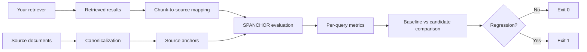

<div align="center">


# SPANCHOR

**Source-anchored regression testing for RAG retrieval pipelines.**

[](https://pypi.org/project/spanchor/)
[](https://pypi.org/project/spanchor/)
[](LICENSE)
[](https://github.com/Mukeshram-07/spanchor/actions/workflows/ci.yml)
[](https://github.com/Mukeshram-07/spanchor/actions/workflows/release.yml)

```bash
pip install spanchor
```

</div>

Detect retrieval regressions when chunking, indexing, ranking, or retrieval configurations change, using stable source-document evidence instead of fragile chunk IDs.

[GitHub](https://github.com/Mukeshram-07/spanchor) · [PyPI](https://pypi.org/project/spanchor/) · [Changelog](CHANGELOG.md)

[Why SPANCHOR](#why-spanchor) · [Quick start](#60-second-quick-start) · [Metrics](#metrics) · [Framework integrations](#framework-integrations) · [CI](#use-spanchor-as-a-ci-regression-gate) · [CLI](#cli) · [Documentation](#documentation)

---

## Why SPANCHOR?

Retrieval evaluation is often tied to chunk IDs or chunk boundaries. Change the chunk size and the labels no longer line up, so you cannot tell whether retrieval got better or worse.

**Traditional evaluation**

```
Question → expected chunk ID → retrieved chunk ID → pass/fail
```

Re-chunking invalidates the gold labels.

**SPANCHOR**

```
Question → expected source span → retrieved text → source-span overlap
         → per-query metrics → regression decision
```

The canonical source document is the stable reference point. Documents are normalized (NFC Unicode, `\n` line endings) and hash-validated, so an anchor that no longer matches its source fails loudly instead of silently drifting.

With SPANCHOR you can change your chunker, index, retriever, or reranker and still measure whether the same source evidence is being retrieved, query by query.

## Who is SPANCHOR for?

SPANCHOR is useful if you:

- build RAG systems and change chunking or retrieval strategies
- evaluate retrievers or rerankers
- maintain retrieval benchmarks
- want retrieval regression tests in CI
- use LangChain, LlamaIndex, or a custom retrieval stack
- need source-evidence-level evaluation rather than fragile chunk-ID comparisons

## How it works

1. **Anchor** expected evidence to character spans in canonical source documents.
2. **Map** retrieved chunk text back to those source spans (or pass spans directly).
3. **Score** each query: Recall@K, Precision@K, Hit@K, FullEvidence@K, IoU.
4. **Compare** a baseline run against a candidate run under a per-metric policy.
5. **Gate** CI on the result.



SPANCHOR sits after retrieval: **RAG pipeline → retrieval → SPANCHOR → regression gate → CI decision.**

## Key features

- **Source-anchored evaluation**: gold labels point to spans in canonical documents
- **Character-level span metrics**: Recall@K, Precision@K, Hit@K, FullEvidence@K, IoU
- **Per-query regression detection** with configurable per-metric thresholds
- **Baseline vs candidate comparison** with markdown reports
- **Adapters**: generic dicts, LangChain, LlamaIndex
- **CLI** for validate, evaluate, compare, locate, check-corpus, and anchor add
- **CI exit codes** for pass, regression, usage error, and unmapped-chunk-rate failures
- **Local-first and deterministic**: no network access or API keys required
- **Typed Python API**: checked with `mypy --strict`

## Installation

```bash
pip install spanchor                 # core library and CLI
pip install "spanchor[langchain]"    # + LangChain adapter dependencies
pip install "spanchor[llamaindex]"   # + LlamaIndex adapter dependencies
```

The LangChain and LlamaIndex integrations are optional extras and are not installed by default. Requires Python 3.11 or newer (tested on 3.11, 3.12, 3.13).

## 60-second quick start

```python
from spanchor import Anchor, Document, Query, compare, evaluate
from spanchor.adapters.generic import dicts_to_retrieval_results
from spanchor.canonical.normalize import compute_hash

# 1. Canonical source document
text = "CloudSync is a cloud storage service. It syncs files across devices."
doc = Document.from_text("doc1", text)

# 2. Anchor the expected evidence to a source span
evidence = "CloudSync is a cloud storage service."
start = text.index(evidence)
anchor = Anchor("doc1", start, start + len(evidence), compute_hash(evidence))

# 3. Define the query
query = Query("q1", "What is CloudSync?", (anchor,))

# 4. Convert retrieval results (chunk text from any retriever)
baseline_results = {"q1": dicts_to_retrieval_results([{"text": evidence, "score": 0.9}])}
candidate_results = {"q1": dicts_to_retrieval_results([{"text": "It syncs files across devices.", "score": 0.9}])}

# 5. Evaluate both configurations
documents = {"doc1": doc}
baseline = evaluate(documents, [query], baseline_results, k=5)
candidate = evaluate(documents, [query], candidate_results, k=5)
print(baseline.aggregate_metrics["mean_recall@5"])  # 1.0

# 6. Compare per query against a policy (max allowed drop per metric)
result = compare(baseline, candidate, policy={"recall@5": 0.05})

# 7. Detect the regression
print(result.has_regression)      # True
print(result.per_query_status)    # {'q1': 'REGRESSION'}
```

Results given as chunk text (no `document_id`, no offsets) are mapped to source spans automatically. If you already know the source span, pass `document_id`, `start`, and `end` instead.

A gold set with only a handful of queries triggers a low-confidence warning; real gold sets should be larger.

## Regression example

A validated benchmark from this repository: 100 gold queries over 4 technical documents (`examples/real_world_validation/`).

| | Baseline | Candidate |
|---|---|---|
| Chunk size | 250 | 200 |
| Overlap | 0 | 50 |
| Recall@5 | **0.405** | **0.249** |

```
Regressions:  19 queries exceeded the configured threshold
Status:       FAIL
Exit code:    1
```

This is a measured result from the included validation run, not a hypothetical. It is specific to this corpus and these configurations; it demonstrates the regression-testing mechanism and is not a general claim about chunk size or overlap.

## Metrics

| Metric | Meaning |
|---|---|
| **Recall@K** | Fraction of gold-evidence characters covered by the top-K retrieved spans |
| **Precision@K** | Fraction of retrieved characters that overlap gold evidence |
| **Hit@K** | Whether at least one gold span is covered by at least 50% (default `min_overlap`) |
| **FullEvidence@K** | Whether every gold span is covered by at least 50% |
| **IoU** | Intersection-over-union between retrieved and gold characters (diagnostic) |

**Aggregate metrics** (for example `mean_recall@5`) are for reporting and trending.
**Per-query metrics** are what the regression gate uses. Each query is classified as `IMPROVED`, `UNCHANGED`, or `REGRESSION` against the policy, and any single `REGRESSION` fails the comparison. An aggregate improvement does not cancel an individual query regression.

## Framework integrations

All adapters return SPANCHOR `RetrievalResult` lists, ready for `evaluate()`.

**Generic**: `dict_to_retrieval_result()` and `dicts_to_retrieval_results()` accept common field aliases (`text`/`chunk`/`content`/`body`, `score`/`similarity`, and others).

```python
from spanchor.adapters.generic import dicts_to_retrieval_results

results = dicts_to_retrieval_results([{"text": "retrieved chunk", "score": 0.95}])
```

**LangChain** (`pip install "spanchor[langchain]"`)

```python
from spanchor.adapters.langchain import documents_to_retrieval_results

docs = retriever.invoke("your query")           # list of LangChain Documents
results = documents_to_retrieval_results(docs)  # score_key / document_id_key are configurable
```

**LlamaIndex** (`pip install "spanchor[llamaindex]"`)

```python
from spanchor.adapters.llamaindex import nodes_to_retrieval_results

nodes = retriever.retrieve("your query")        # list of NodeWithScore
results = nodes_to_retrieval_results(nodes)
```

## Use SPANCHOR as a CI regression gate

```
Baseline retrieval run
        ↓
Candidate retrieval run
        ↓
spanchor compare
        ↓
Policy thresholds
        ↓
PASS / FAIL
```

```bash
spanchor evaluate docs/ gold.jsonl baseline_results.json  -o baseline.json
spanchor evaluate docs/ gold.jsonl candidate_results.json -o candidate.json
spanchor compare baseline.json candidate.json --policy policy.json --report comparison.md
```

`policy.json` sets the maximum allowed per-query drop for each metric:

```json
{"recall@5": 0.05, "precision@5": 0.05, "hit@5": 0.1}
```

| Exit code | Meaning |
|---|---|
| `0` | Success, or no regression (`compare`) |
| `1` | Regression detected (`compare`) |
| `2` | Schema, usage, or validation error |
| `3` | Unmapped chunk rate exceeded (`evaluate`) |

## CLI

| Command | Purpose |
|---|---|
| `spanchor validate DOCS_DIR GOLD_PATH` | Validate every anchor against its source document |
| `spanchor evaluate DOCS_DIR GOLD_PATH RESULTS_PATH` | Compute metrics (`--k`, `--output`, `--report`, `--max-unmapped-rate`, `--redact`) |
| `spanchor compare BASELINE CANDIDATE` | Per-query regression comparison (`--policy`, `--report`, `--max-recall-drop`, `--max-precision-drop`, `--redact`) |
| `spanchor locate TEXT DOCS_DIR` | Find text in documents and print anchor offsets and hash |
| `spanchor check-corpus DOCS_DIR GOLD_PATH` | Check anchor hashes, bounds, and text against the corpus |
| `spanchor anchor add` | Add a validated anchor to a gold JSONL file |

Run `spanchor <command> --help` for full options.

## Real-world validation and adoption demo

[`examples/adoption_demo/`](examples/adoption_demo/) runs a complete, self-checking scenario: source documents, gold queries, baseline and candidate retrieval, a regression scenario that fails, and a passing scenario that succeeds.

```bash
cd examples/adoption_demo
python run_demo.py
```

The underlying benchmark and its scripts live in [`examples/real_world_validation/`](examples/real_world_validation/README.md).

## Documentation

| Resource | Purpose |
|---|---|
| [Adoption demo](examples/adoption_demo/README.md) | Integrating SPANCHOR into a retrieval pipeline |
| [Real-world validation](examples/real_world_validation/README.md) | 100-query benchmark and regression scenario |
| [Minimal demo](examples/demo/README.md) | Small CLI walkthrough with a gold set |
| [Changelog](CHANGELOG.md) | Release history |

## Scope

SPANCHOR is an evaluation layer. It does not:

- retrieve documents
- generate embeddings
- chunk documents
- generate answers
- host a vector database
- parse PDFs or run OCR
- provide an LLM
- replace a RAG framework

It is designed to sit next to whichever of these you already use.

SPANCHOR is an early-stage open-source project; APIs and integrations may evolve.

## Development

```bash
git clone https://github.com/Mukeshram-07/spanchor.git
cd spanchor
pip install -e ".[dev]"

pytest
mypy --strict src/spanchor
ruff check src/spanchor --select E,W,F,I --ignore B008,E501
ruff format src/spanchor tests --check

pip install build && python -m build
```

## Testing

v0.2.0 is validated by 754 automated tests. Measured line and branch coverage is currently about 79%; this is a snapshot, not a guarantee.

```bash
pytest
```

## Roadmap

**Current release: v0.2.0**

Implemented:
- Source-anchored evaluation and per-query regression detection
- Generic, LangChain, and LlamaIndex adapters
- CLI with CI exit codes
- Adoption demo and real-world validation example

**Planned / exploratory** (not committed to any release)
- Schema versioning improvements
- Richer policy configuration
- Performance work
- Additional framework adapters

## Contributing

Contributions are welcome. Please open a pull request that includes tests for new behavior and passes `pytest`, `mypy --strict`, and `ruff`.

## License

Apache-2.0. See [LICENSE](LICENSE).